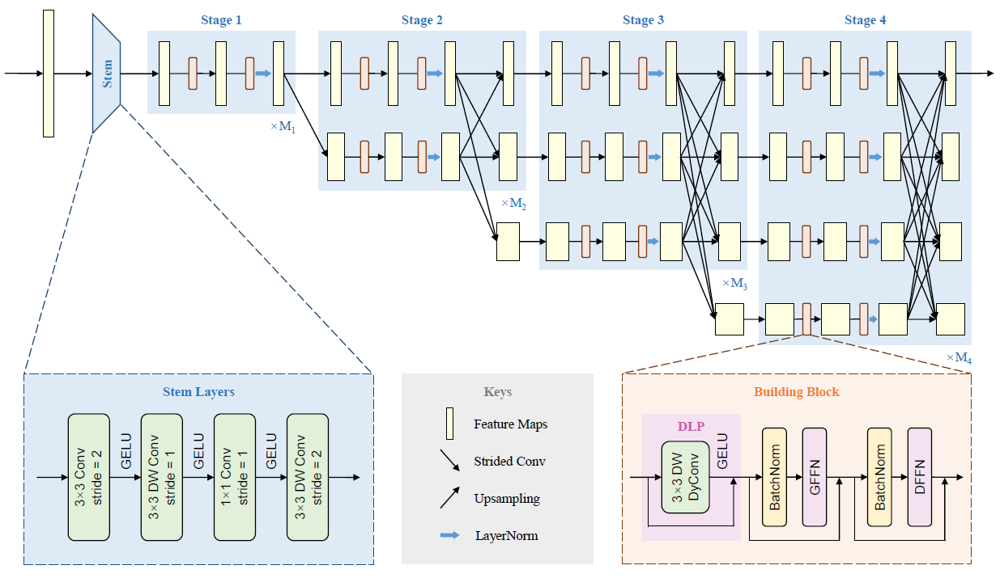
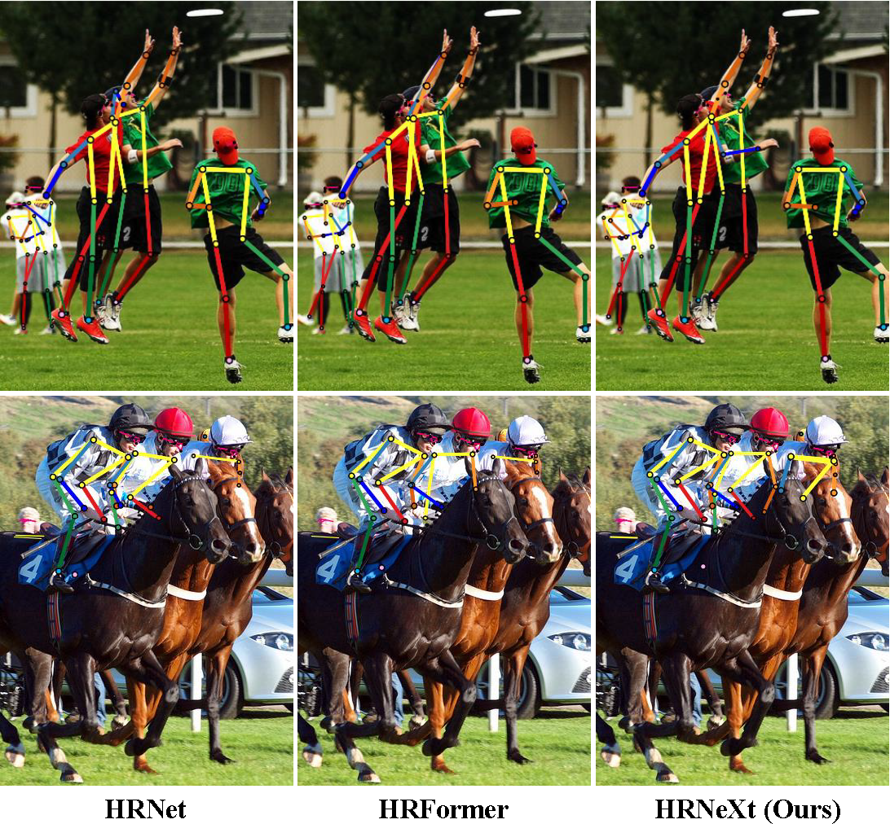

# HRNeXt: High-Resolution Context Network for Crowd Pose Estimation

## Introduction
This is an official repository of our paper ***[HRNeXt: High-Resolution Context Network for Crowd Pose Estimation](https://doi.org/10.1109/TMM.2023.3248144)*** (published in ***IEEE Transactions on Multimedia***). In this work, we present a novel network backbone High-Resolution Context Network (HRNeXt), which learns high-resolution representations with abundant contextual information to better estimate poses of occluded human bodies. Compared to state-of-the-art pose estimation networks, our HRNeXt is more efficient in terms of training data size, network parameters and computational cost. Experimental results show that our HRNeXt significantly outperforms state-of-the-art backbone networks on challenging pose estimation datasets with high occurrence of crowds and occlusions.




Benefiting from the superb context modeling ability, our HRNeXt can detect more keypoints and better estimate poses of occluded human bodies.



It is hoped that our HRNeXt will be a perfect substitute for other widely-used backbone networks (e.g. [HRNet](https://github.com/HRNet/HRNet-Human-Pose-Estimation), [HRFormer](https://github.com/HRNet/HRFormer), etc.) on dense prediction tasks, since our backbone can achieve much better performance in terms of trade-off between accuracy and computational complexity.

## Models and results

#### Comparison with [HRNet](https://github.com/HRNet/HRNet-Human-Pose-Estimation) and [HRFormer](https://github.com/HRNet/HRFormer) using bounding boxes from a human detector on the COCO `val2017` dataset

| Backbone            | Pretrain | Input Size  |  #Params  |   FLOPs   |    AP     | AP<sup>50</sup> | AP<sup>75</sup> | AP<sup>M</sup> | AP<sup>L</sup> | AR        |
| :------------------ | :------: | :---------: | :-------: | :-------: | :-------: | :-------------: | :-------------: | :------------: | :------------: | --------- |
| HRNet-W32           |    Y     |   256×192   |   28.5M   |   7.1G    |   0.734   |      0.895      |      0.807      |     0.702      |     0.801      | 0.789     |
| HRNet-W32           |    Y     |   384×288   |   28.5M   |   16.0G   |   0.758   |      0.906      |      0.827      |     0.719      |     0.828      | 0.810     |
| HRNet-W48           |    Y     |   256×192   |   63.6M   |   14.6G   |   0.751   |      0.906      |      0.822      |     0.715      |     0.818      | 0.804     |
| HRNet-W48           |    Y     |   384×288   |   63.6M   |   32.9G   |   0.763   |      0.908      |      0.829      |     0.723      |     0.834      | 0.812     |
| HRFormer-S          |    Y     |   256×192   |   7.8M    |   2.8G    |   0.740   |      0.902      |      0.812      |     0.704      |     0.807      | 0.794     |
| HRFormer-S          |    Y     |   384×288   |   7.8M    |   6.2G    |   0.756   |      0.903      |      0.822      |     0.716      |     0.825      | 0.807     |
| HRFormer-B          |    Y     |   256×192   |   43.2M   |   12.2G   |   0.756   |      0.908      |      0.828      |     0.717      |     0.826      | 0.808     |
| HRFormer-B          |    Y     |   384×288   |   43.2M   |   26.8G   |   0.772   |      0.910      |      0.836      |     0.732      |     0.842      | 0.820     |
| **HRNeXt-S (Ours)** |  **N**   | **256×192** | **9.5M**  | **2.5G**  | **0.761** |    **0.906**    |    **0.834**    |   **0.728**    |   **0.827**    | **0.813** |
| **HRNeXt-B (Ours)** |  **N**   | **384×288** | **31.7M** | **10.8G** | **0.770** |    **0.911**    |    **0.835**    |   **0.732**    |   **0.841**    | **0.820** |

#### Comparison with [HRNet](https://github.com/HRNet/HRNet-Human-Pose-Estimation) and [HRFormer](https://github.com/HRNet/HRFormer) using ground-truth bounding box on the OCHuman `val` dataset.

| Backbone            | Pretrain | Input Size  |  #Params  |   FLOPs   |    AP     | AP<sup>50</sup> | AP<sup>75</sup> | AP<sup>M</sup> | AP<sup>L</sup> |    AR     |
| :------------------ | :------: | :---------: | :-------: | :-------: | :-------: | :-------------: | :-------------: | :------------: | :------------: | :-------: |
| HRNet-W32           |    Y     |   256×192   |   28.5M   |   7.1G    |   0.631   |      0.794      |      0.690      |     0.642      |     0.631      |   0.673   |
| HRNet-W32           |    Y     |   384×288   |   28.5M   |   16.0G   |   0.637   |      0.784      |      0.690      |     0.643      |     0.637      |   0.676   |
| HRNet-W48           |    Y     |   256×192   |   63.6M   |   14.6G   |   0.645   |      0.794      |      0.701      |     0.651      |     0.645      |   0.685   |
| HRNet-W48           |    Y     |   384×288   |   63.6M   |   32.9G   |   0.650   |      0.784      |      0.703      |     0.684      |     0.650      |   0.688   |
| HRFormer-S          |    Y     |   256×192   |   7.8M    |   2.8G    |   0.584   |      0.757      |      0.633      |     0.647      |     0.584      |   0.631   |
| HRFormer-S          |    Y     |   384×288   |   7.8M    |   6.2G    |   0.595   |      0.756      |      0.640      |     0.641      |     0.595      |   0.642   |
| HRFormer-B          |    Y     |   256×192   |   43.2M   |   12.2G   |   0.603   |      0.749      |      0.647      |     0.640      |     0.603      |   0.647   |
| HRFormer-B          |    Y     |   384×288   |   43.2M   |   26.8G   |   0.625   |      0.762      |      0.660      |     0.652      |     0.625      |   0.665   |
| **HRNeXt-S (Ours)** |  **N**   | **256×192** | **9.5M**  | **2.5G**  | **0.631** |    **0.784**    |    **0.681**    |   **0.648**    |   **0.631**    | **0.670** |
| **HRNeXt-B (Ours)** |  **N**   | **384×288** | **31.7M** | **10.8G** | **0.671** |    **0.805**    |    **0.716**    |   **0.706**    |   **0.672**    | **0.706** |

Example checkpoint files of our HRNeXt models are available at [GoogleDrive](https://drive.google.com/drive/folders/19b2s39Sbd7wXO1KdTyFOebvVQyljQDNz?usp=sharing).

## Environment

The code is developed and tested using python 3.7 and 8 GeForce RTX 3090 GPUs. Other python versions or GPUs are not fully tested.

#### Requirements

- Linux (Windows is not officially supported)
- Python 3.7+
- PyTorch 1.3+
- CUDA 9.2+ (If you build PyTorch from source, CUDA 9.0 is also compatible)
- GCC 5+
- [mmcv](https://github.com/open-mmlab/mmcv) (Please install the latest version of mmcv-full)
- Numpy
- cv2
- json_tricks
- [xtcocotools](https://github.com/jin-s13/xtcocoapi)

## Quick Start


### 1. Installation

<!-- The code is based on [MMPose](https://github.com/open-mmlab/mmpose).
You need clone the mmpose project and integrate the codes into mmpose first. -->

a. Install mmcv, we recommend you to install the pre-build mmcv as below.

```shell
pip install mmcv-full -f https://download.openmmlab.com/mmcv/dist/{cu_version}/{torch_version}/index.html
```

Please replace ``{cu_version}`` and ``{torch_version}`` in the url to your desired one. For example, to install the latest ``mmcv-full`` with ``CUDA 11.3`` and ``PyTorch 1.10.0``, use the following command:

```shell
pip install mmcv-full -f https://download.openmmlab.com/mmcv/dist/cu113/torch1.10.0/index.html
```

See [here](https://github.com/open-mmlab/mmcv#installation) for different versions of MMCV compatible to different PyTorch and CUDA versions.

Optionally you can choose to compile mmcv from source by the following command

```shell
git clone https://github.com/open-mmlab/mmcv.git
cd mmcv
MMCV_WITH_OPS=1 pip install -e .  # package mmcv-full, which contains cuda ops, will be installed after this step
# OR pip install -e .  # package mmcv, which contains no cuda ops, will be installed after this step
cd ..
```

**Important:** You need to run `pip uninstall mmcv` first if you have mmcv installed. If mmcv and mmcv-full are both installed, there will be `ModuleNotFoundError`.

b. Install build requirements

```shell
pip install -r requirements.txt
```

### 2. Data Preparation

It is recommended to symlink the dataset root to `$HRNEXT/data`.
If your folder structure is different, you may need to change the corresponding paths in config files.

**For COCO dataset**, please download from [COCO download](http://cocodataset.org/#download), 2017 Train/Val is needed for COCO keypoints training and validation. [HRNet-Human-Pose-Estimation](https://github.com/HRNet/HRNet-Human-Pose-Estimation) provides person detection result of COCO val2017 to reproduce our multi-person pose estimation results. Please download from [OneDrive](https://1drv.ms/f/s!AhIXJn_J-blWzzDXoz5BeFl8sWM-) or [GoogleDrive](https://drive.google.com/drive/folders/1fRUDNUDxe9fjqcRZ2bnF_TKMlO0nB_dk?usp=sharing). Optionally, to evaluate on COCO test-dev2017, please download the [image-info](https://download.openmmlab.com/mmpose/datasets/person_keypoints_test-dev-2017.json).
Download and extract them under `$HRNEXT/data`, and make them look like this:

```
$HRNEXT
├── configs
├── models
├── tools
`── data
    │── coco
        │-- annotations
        │   │-- person_keypoints_train2017.json
        │   |-- person_keypoints_val2017.json
        │   |-- person_keypoints_test-dev-2017.json
        |-- person_detection_results
        |   |-- COCO_val2017_detections_AP_H_56_person.json
        |   |-- COCO_test-dev2017_detections_AP_H_609_person.json
        │-- train2017
        │   │-- 000000000009.jpg
        │   │-- 000000000025.jpg
        │   │-- 000000000030.jpg
        │   │-- ...
        `-- val2017
            │-- 000000000139.jpg
            │-- 000000000285.jpg
            │-- 000000000632.jpg
            │-- ...

```

**For CrowdPose dataset**, please download from [CrowdPose](https://github.com/Jeff-sjtu/CrowdPose).
Please download the annotation files and human detection results from [crowdpose_annotations](https://download.openmmlab.com/mmpose/datasets/crowdpose_annotations.tar).
For top-down approaches, we follow [CrowdPose](https://arxiv.org/abs/1812.00324) to use the [pre-trained weights](https://pjreddie.com/media/files/yolov3.weights) of [YOLOv3](https://github.com/eriklindernoren/PyTorch-YOLOv3) to generate the detected human bounding boxes.
For model training, we follow [HigherHRNet](https://github.com/HRNet/HigherHRNet-Human-Pose-Estimation) to train models on CrowdPose train/val dataset, and evaluate models on CrowdPose test dataset.
Download and extract them under $HRNEXT/data, and make them look like this:

```text
$HRNEXT
├── configs
├── models
├── tools
`── data
    │── crowdpose
        │-- annotations
        │   │-- mmpose_crowdpose_train.json
        │   │-- mmpose_crowdpose_val.json
        │   │-- mmpose_crowdpose_trainval.json
        │   │-- mmpose_crowdpose_test.json
        │   │-- det_for_crowd_test_0.1_0.5.json
        │-- images
            │-- 100000.jpg
            │-- 100001.jpg
            │-- 100002.jpg
            │-- ...

```

**For OCHuman dataset**, please download the images and annotations from [OCHuman](https://github.com/liruilong940607/OCHumanApi).
Move them under $HRNEXT/data, and make them look like this:

```text
$HRNEXT
├── configs
├── models
├── tools
`── data
    │── ochuman
        │-- annotations
        │   │-- ochuman_coco_format_val_range_0.00_1.00.json
        │   |-- ochuman_coco_format_test_range_0.00_1.00.json
        |-- images
            │-- 000001.jpg
            │-- 000002.jpg
            │-- 000003.jpg
            │-- ...

```

## Training and Testing

### 1. Training

All outputs (log files and checkpoints) will be saved to the working directory,
which is specified by `work_dir` in the config file.

By default we evaluate the model on the validation set after each epoch, you can change the evaluation interval by modifying the interval argument in the training config

```python
evaluation = dict(interval=5)  # This evaluate the model per 5 epoch.
```

According to the [Linear Scaling Rule](https://arxiv.org/abs/1706.02677), you need to set the learning rate proportional to the batch size if you use different GPUs or videos per GPU, e.g., lr=0.01 for 4 GPUs x 2 video/gpu and lr=0.08 for 16 GPUs x 4 video/gpu.

```shell
# train with a signle GPU
python tools/train.py ${CONFIG_FILE} [optional arguments]

# train with multiple GPUs
./tools/dist_train.sh ${CONFIG_FILE} ${GPU_NUM} [optional arguments]
```

Optional arguments are:

- `--work-dir ${WORK_DIR}`: Override the working directory specified in the config file.
- `--resume-from ${CHECKPOINT_FILE}`: Resume from a previous checkpoint file.
- `--no-validate`: Whether not to evaluate the checkpoint during training.
- `--gpus ${GPU_NUM}`: Number of gpus to use, which is only applicable to non-distributed training.
- `--gpu-ids ${GPU_IDS}`: IDs of gpus to use, which is only applicable to non-distributed training.
- `--seed ${SEED}`: Seed id for random state in python, numpy and pytorch to generate random numbers.
- `--deterministic`: If specified, it will set deterministic options for CUDNN backend.
- `--cfg-options CFG_OPTIONS`: Override some settings in the used config, the key-value pair in xxx=yyy format will be merged into config file. For example, '--cfg-options model.backbone.depth=18 model.backbone.with_cp=True'.
- `--launcher ${JOB_LAUNCHER}`: Items for distributed job initialization launcher. Allowed choices are `none`, `pytorch`, `slurm`, `mpi`. Especially, if set to none, it will test in a non-distributed mode.
- `--autoscale-lr`: If specified, it will automatically scale lr with the number of gpus by [Linear Scaling Rule](https://arxiv.org/abs/1706.02677).
- `LOCAL_RANK`: ID for local rank. If not specified, it will be set to 0.

Difference between `resume-from` and `load-from`:
`resume-from` loads both the model weights and optimizer status, and the epoch is also inherited from the specified checkpoint. It is usually used for resuming the training process that is interrupted accidentally.
`load-from` only loads the model weights and the training epoch starts from 0. It is usually used for finetuning.

Example:

```shell
# train HRNeXt-S on COCO dataset with 8 GPUs
./tools/dist_train.sh configs/coco/hrnext_small_coco_256x192.py 8
```

### 2. Testing

You can use the following commands to test a dataset.

```shell
# single-gpu testing
python tools/test.py ${CONFIG_FILE} ${CHECKPOINT_FILE} [--out ${RESULT_FILE}] [--fuse-conv-bn] \
    [--eval ${EVAL_METRICS}] [--gpu_collect] [--tmpdir ${TMPDIR}] [--cfg-options ${CFG_OPTIONS}] \
    [--launcher ${JOB_LAUNCHER}] [--local_rank ${LOCAL_RANK}]

# multi-gpu testing
./tools/dist_test.sh ${CONFIG_FILE} ${CHECKPOINT_FILE} ${GPU_NUM} [--out ${RESULT_FILE}] [--fuse-conv-bn] \
    [--eval ${EVAL_METRIC}] [--gpu_collect] [--tmpdir ${TMPDIR}] [--cfg-options ${CFG_OPTIONS}] \
    [--launcher ${JOB_LAUNCHER}] [--local_rank ${LOCAL_RANK}]
```

Note that the provided `CHECKPOINT_FILE` is either the path to the model checkpoint file downloaded in advance, or the url link to the model checkpoint.

Optional arguments:

- `RESULT_FILE`: Filename of the output results. If not specified, the results will not be saved to a file.
- `--fuse-conv-bn`: Whether to fuse conv and bn, this will slightly increase the inference speed.
- `EVAL_METRICS`: Items to be evaluated on the results. Allowed values depend on the dataset.
- `--gpu_collect`: If specified, recognition results will be collected using gpu communication. Otherwise, it will save the results on different gpus to `TMPDIR` and collect them by the rank 0 worker.
- `TMPDIR`: Temporary directory used for collecting results from multiple workers, available when `--gpu_collect` is not specified.
- `CFG_OPTIONS`: Override some settings in the used config, the key-value pair in xxx=yyy format will be merged into config file. For example, '--cfg-options model.backbone.depth=18 model.backbone.with_cp=True'.
- `JOB_LAUNCHER`: Items for distributed job initialization launcher. Allowed choices are `none`, `pytorch`, `slurm`, `mpi`. Especially, if set to none, it will test in a non-distributed mode.
- `LOCAL_RANK`: ID for local rank. If not specified, it will be set to 0.

Example:

```shell
# test HRNeXt-S on COCO (without saving the test results) dataset with 8 GPUS, and evaluate the mAP.
./tools/dist_test.sh configs/coco/hrnext_small_coco_256x192.py \
    checkpoints/SOME_CHECKPOINT.pth 8 \
    --eval mAP
```

### 3. Computing model complexity

You can use the following commands to compute the complexity of one model.

```shell
python tools/summary_network.py ${CONFIG_FILE} --shape ${SHAPE}
```

- `SHAPE`: Input size.

Example:

```shell
# compute the complexity of HRNeXt-S with 256x192 resolution input.
python tools/summary_network.py configs/coco/hrnext_small_coco_256x192.py \
    --shape 256 192 \
```

## Acknowledgement

Thanks to:

- [MMPose](https://github.com/open-mmlab/mmpose)
- [HRNet](https://github.com/HRNet/deep-high-resolution-net.pytorch)
- [HRFormer](https://github.com/HRNet/HRFormer)
